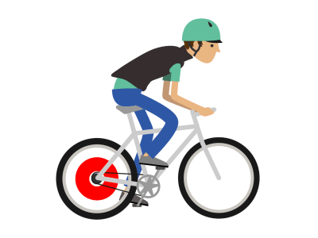

<h1 align="center">
  
</h1>

---

# ESILV - Seoul Bike Sharing

- Steps 1 : Analyse the differents variables of a dataset in the context
- Steps 2 : Show the link between the variables and the target with Jupyter
- Steps 3 : Improve the model with test and compare with the main model
- Steps 4 : Transformation of the model into an API with Django

## About Dataset

- Currently Rental bikes are introduced in many urban cities for the enhancement of mobility comfort. It is important to make the rental bike available and accessible to the public at the right time as it lessens the waiting time. Eventually, providing the city with a stable supply of rental bikes becomes a major concern.

- The dataset contains weather information (Temperature, Humidity, Windspeed, Visibility, Dewpoint, Solar radiation, Snowfall, Rainfall), the number of bikes rented per hour and date information.

## Problem

The crucial part is the prediction of bike count required at each hour for the stable supply of rental bikes

## Tech Stack
**Client:** Jupyter
**Server:** Django

## Authors

- [@Pierre](https://github.com/Pierre-Portfolio)
- [@Anthony](https://github.com/Cyd-des-Tenebres)

## Screenshots

## Conclusion

This projects was a real challenge for us as well on a technical level with software like Django or Github

