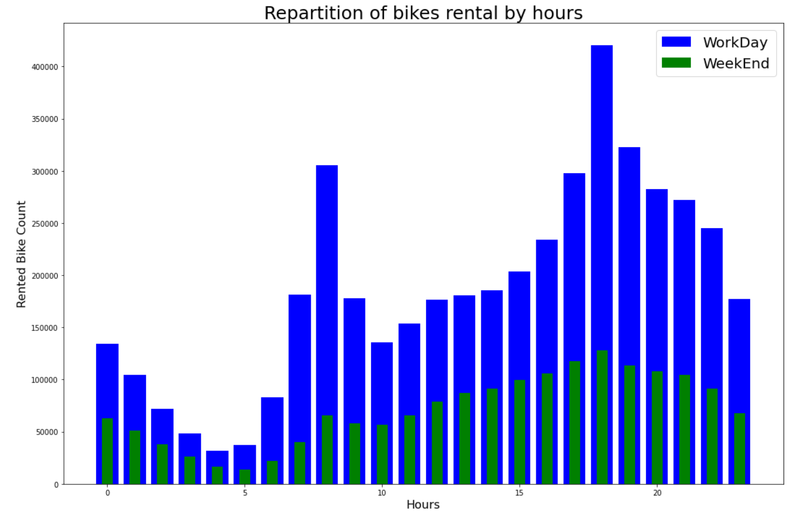
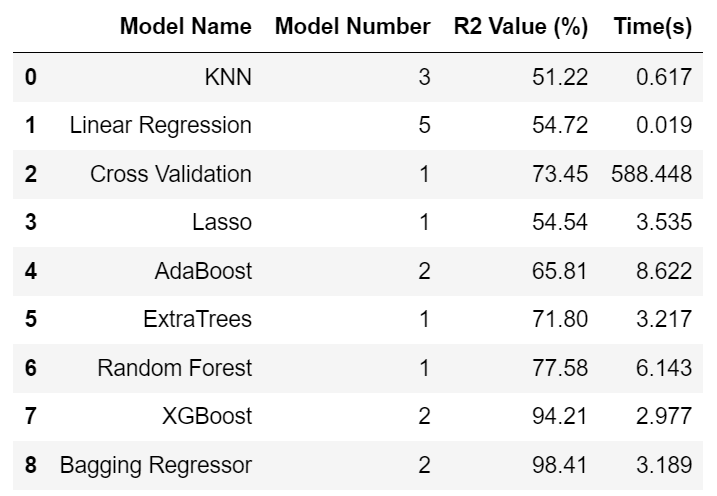
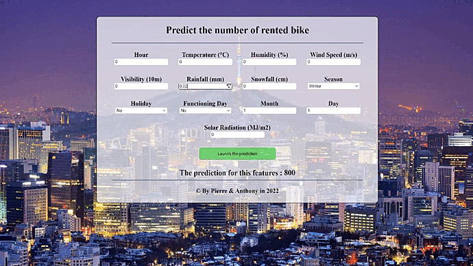

<h1 align="center">
  
</h1>

---

# ESILV - Seoul Bike Sharing
## About Dataset

- Rental bikes have been introduced in many cities to improve the mobility. The way they are made available to the public is critical to lower the waiting time. Providing the city with a sufficient set of rental bikes becomes a major concern.

- The data set contains complete weather information (Temperature, Humidity, Wind-speed, Visibility, Dew-point, Solar radiation, Snowfall, Rainfall) as well as the number of bikes in use all along the day.

## Problem

- The crucial part is to estimate the number of bikes necessary to cover the needs of the city according  the time of the day, the day of the week and the season. We are therefore facing a regression problem for the machine learning.

## Techno Used during this project
- PYTHON
- JUPYTER
- SPYDER
- FLASK

## Data-Visualizations

## Model Testing in Jupyter

- KNN
- Linear Regression
- Cross Validation
- Lasso
- AdaBoost
- ExtraTrees
- Random Forest
- XGBoost
- Bagging

## Model Result

## Conclusion

- Seoul people mainly use rental bikes for going to work and coming back home
- Linear Regression is the fastest model
- The best data set is the number #2
- Bagging is providing the best r2 accuracy

## Responsive Api Video Demo

- You can see here a little video presenting the API

## Authors

- [@Pierre](https://github.com/Pierre-Portfolio)
- [@Cyd](https://github.com/Cyd-des-Tenebres)
